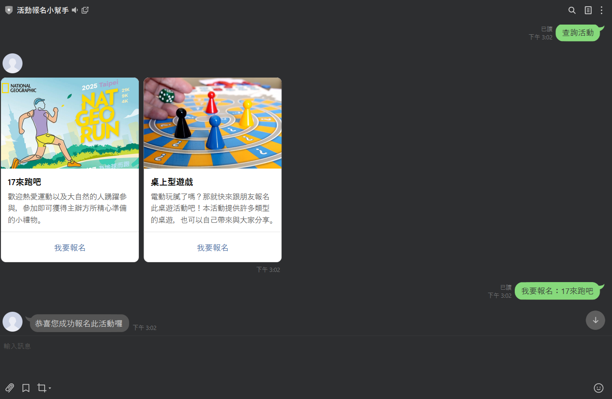

# LINE 報名系統

利用 **LINE Messaging API** 建立報名系統，  
使用者可以透過 LINE 聊天輸入報名資訊，  
資料會自動紀錄到 Google 試算表，簡化活動報名流程。

---

## 功能特色
- 使用 LINE 聊天視窗完成報名
- 自動將報名者資訊存入 Google 試算表
- 適合小型活動或社團聚會使用
- 節省人工整理與統計時間

---

## 使用技術
- LINE Messaging API
- Google Apps Script
- Google Sheets API

---

## 範例成果

